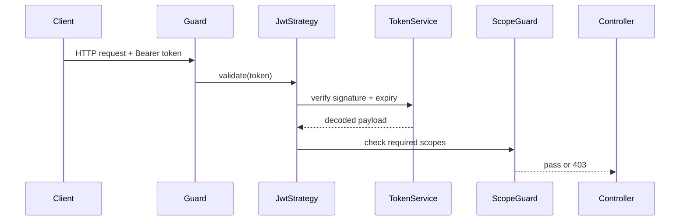

# Write Doc

Produce a clean, well-structured markdown document from one of two sources:

- **Mode 1 — Conversation to doc:** Synthesise the current conversation into a document — capturing decisions, key points, and outcomes.
- **Mode 2 — Explore and document:** Investigate a codebase feature, then write technical documentation explaining how it works.

Detect the mode from the user's trigger phrase. If unclear, ask one question: *"Should I document this conversation, or explore a feature in the codebase?"*

## When to invoke

- "write this to a doc" / "write this conversation to a doc" / "document this"
- "document this conversation" / "save this as a note"
- "explore X and write the doc" / "write how X works" / "document this feature"
- "write up how [feature/system/component] works"
- User has just finished a design discussion and asks for a record of it

## When NOT to use

- **No conversation has happened yet.** There is nothing to document. Tell the user to start the conversation first.
- **The feature to document hasn't been specified.** Ask what feature before doing anything.
- **The user wants a raw transcript.** This skill synthesises — it does not transcribe. Clarify and confirm before proceeding.

---

## Mode 1 — Conversation to Doc

### What to capture

Synthesise — do not transcribe. Extract:

- **Context / background** — what problem or topic was being addressed
- **Key decisions** — what was decided and why
- **Outcomes / conclusions** — what was agreed, built, or resolved
- **Open questions** — anything left unresolved

Do not reproduce the raw back-and-forth. Write it as a standalone document a reader could understand without having been in the conversation.

### Diagrams

If the conversation involved a design, architecture, flow, or system interaction, include a Mermaid diagram to visualise it. Choose the diagram type that best fits:

- `sequenceDiagram` — interaction between services or modules over time
- `stateDiagram-v2` — state machines, lifecycle flows
- `flowchart` — process flows, decision trees
- `classDiagram` — module/class structure and relationships

Only include a diagram if it adds clarity. Skip it for purely discussion-based conversations with no structural content worth visualising.

---

## Mode 2 — Explore and Document a Feature

### Step 1 — Ask clarifying questions

Before exploring, ask the user two things:

1. **Depth** — high-level overview, or deep technical detail?
2. **Scope** — any specific aspects to focus on or exclude?

Ask both questions together in one message. Wait for the user's answers before exploring.

### Step 2 — Explore the codebase

Use grep, glob, and file reads to understand the feature. Trace the code paths, identify key modules, understand the data flow, and note any edge cases or caveats.

### Step 3 — Write the document

Structure the document as:

```
# <Feature Name>

## Overview
One paragraph explaining what the feature does.

## How It Works
The core mechanism — data flow, control flow, key logic. Include a Mermaid diagram here if the feature involves meaningful interactions between modules, services, or states.

## Key Files / Entry Points
A brief list of the most important files and what role they play.

## Usage / Examples
How to invoke or use the feature. Code examples where helpful.

## Notes / Caveats
Edge cases, gotchas, known limitations, or anything a developer should be aware of.
```

Drop any section that doesn't apply (e.g., skip Usage if the feature is internal with no public API).

### Diagrams

Include at least one Mermaid diagram if the feature has meaningful structure:

- Module or service interactions → `sequenceDiagram`
- State machines or lifecycle → `stateDiagram-v2`
- Process or decision flow → `flowchart`
- Class or module relationships → `classDiagram`

Pick the type that best represents what you found. Include more than one diagram if different aspects benefit from different representations.

---

## Draft and Save (both modes)

### Output flow

1. **Show the draft** in chat as a single block. The user reads it before anything is written to disk.
2. **Invite one round of revisions** — content, sections, diagrams. Apply changes immediately.
3. **Propose a filename and path** (see below). Wait for confirmation.
4. **Create the file** only after path and filename are confirmed.

*One revision is normal. Three is a smell — ask what specific section is wrong rather than keep tweaking blindly.*

### Proposing a filename and path

Suggest a filename based on the content:

- For conversation docs: `yyyy-mm-dd-<topic>.md` (e.g. `2026-05-23-write-doc-skill-design.md`)
- For feature docs: `how-<feature>-works.md` or `<feature>.md`

Suggest a save path by detecting context:

- If an Obsidian vault is identifiable in the working directory or a parent path, suggest a relevant folder inside it
- If the user is in a project repo, suggest `docs/` within that project
- If neither is clear, ask the user where to save

Always confirm the path and filename with the user before writing.

### Markdown flavour

Infer the markdown flavour from the save destination:

- **Obsidian vault path** → use Obsidian-flavored markdown: `[[wikilinks]]`, callouts (`> [!note]`), tags, frontmatter
- **Anywhere else** → use standard markdown

### Creating the file

Write the file only after the user confirms the path and filename. Never overwrite an existing file without explicit permission.

---

## Tone

Write engineer-to-engineer for Mode 2, and peer-to-peer for Mode 1.

- **Synthesise, don't narrate.** Extract signal — decisions, mechanisms, outcomes. Do not reproduce the conversation flow or pad with context the reader already has.
- **Active voice, concrete subjects.** *"The auth module validates the token then checks scopes"* beats *"Token validation is performed by the auth module."*
- **No hedging.** Drop *"appears to," "seems like," "may be."* State it or don't write it.
- **Specific over vague.** Name the actual components, files, decisions. *"The skill asks for depth and scope before exploring"* beats *"The skill gathers some information upfront."*
- **One idea per section.** If a section covers two distinct things, split it.

---

## Worked example — Mode 2 (explore and document)

**Trigger:** *"Explore the auth flow in this repo and write the doc. Deep technical detail. Focus on token validation only — skip OAuth."*

**Skill asks:** *(already answered in trigger — depth: deep, scope: token validation only)*

**Skill explores:** traces `POST /login` → `AuthController` → `TokenService.validate()` → `JwtStrategy` → finds guard decorators, expiry logic, and a refresh path.

**Draft produced:**

```markdown
# Token Validation

## Overview
The token validation flow verifies JWTs on every protected route using a Passport `JwtStrategy`. Tokens are checked for signature, expiry, and scope before the request reaches the controller.

## How It Works



## Key Files / Entry Points
- `src/auth/jwt.strategy.ts` — Passport strategy; calls `TokenService.validate()`
- `src/auth/token.service.ts` — signature verification and expiry logic
- `src/auth/scope.guard.ts` — checks `@RequireScopes()` decorator against payload

## Notes / Caveats
- Tokens are not revoked on logout — only expiry enforced. A stolen valid token remains usable until it expires.
- Clock skew tolerance is set to 30 s in `token.service.ts:42`; adjust if clients show spurious 401s.
```

**Skill then asks:** *"Happy with this draft? Where should I save it — I can suggest `docs/auth/token-validation.md` if that fits."*

---

## Rules

- Never invent facts. If the source material is ambiguous, mark gaps clearly rather than filling with assumptions.
- Never write to disk without user confirmation of path and filename.
- Never overwrite an existing file without explicit permission.
- If the user wants changes to the draft, apply them before saving.
- One revision is normal. Three is a smell — ask what's specifically wrong rather than guessing.
