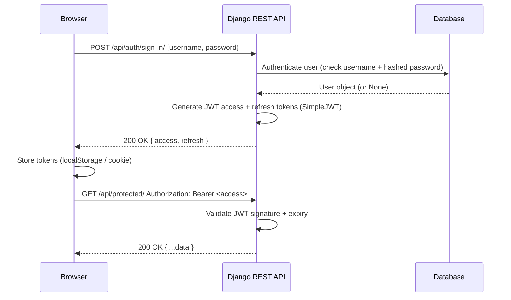

# Write Doc

Produce a clean, well-structured markdown document from one of two sources:

- **Mode 1 — Conversation to doc:** Synthesise the current conversation into a document — capturing decisions, key points, and outcomes.
- **Mode 2 — Explore and document:** Investigate a codebase feature, then write technical documentation explaining how it works.

Detect the mode from the user's trigger phrase. If unclear, ask one question: *"Should I document this conversation, or explore a feature in the codebase?"*

## When to invoke

- "write this to a doc" / "write this conversation to a doc" / "document this"
- "document this conversation" / "save this as a note"
- "explore X and write the doc" / "write how X works" / "document this feature"
- "write up how [feature/system/component] works"
- User has just finished a design discussion and asks for a record of it

## When NOT to use

- **No conversation has happened yet.** There is nothing to document. Tell the user to start the conversation first.
- **The feature to document hasn't been specified.** Ask what feature before doing anything.
- **The user wants a raw transcript.** This skill synthesises — it does not transcribe. Clarify and confirm before proceeding.

---

## Mode 1 — Conversation to Doc

### What to capture

Synthesise — do not transcribe. Extract:

- **Context / background** — what problem or topic was being addressed
- **Key decisions** — what was decided and why
- **Outcomes / conclusions** — what was agreed, built, or resolved
- **Open questions** — anything left unresolved

Do not reproduce the raw back-and-forth. Write it as a standalone document a reader could understand without having been in the conversation.

### Diagrams

If the conversation involved a design, architecture, flow, or system interaction, include a Mermaid diagram to visualise it. Choose the diagram type that best fits:

- `sequenceDiagram` — interaction between services or modules over time
- `stateDiagram-v2` — state machines, lifecycle flows
- `flowchart` — process flows, decision trees
- `classDiagram` — module/class structure and relationships

Only include a diagram if it adds clarity. Skip it for purely discussion-based conversations with no structural content worth visualising.

---

## Mode 2 — Explore and Document a Feature

### Step 1 — Ask clarifying questions

Before exploring, ask the user two things:

1. **Depth** — high-level overview, or deep technical detail?
2. **Scope** — any specific aspects to focus on or exclude?

Ask both questions together in one message. Wait for the user's answers before exploring.

### Step 2 — Explore the codebase

Use grep, glob, and file reads to understand the feature. Trace the code paths, identify key modules, understand the data flow, and note any edge cases or caveats.

### Step 3 — Write the document

Use these sections as the default structure. **Overview and How It Works are mandatory.** The rest are conditional — include them when they add signal, skip or merge them when they don't. If a feature's shape calls for a different section, add it.

**Overview** *(mandatory)* — One paragraph: what the feature does, why it exists, and where it fits in the system. A reader who stops here should have enough context to know whether to keep reading.

**How It Works** *(mandatory)* — The core mechanism: data flow, control flow, key logic. Walk it end-to-end. Include a Mermaid diagram if the feature has meaningful interactions between modules, services, or states (see Diagrams below).

**Request / Response** *(conditional — include for any API or protocol boundary)* — Exact shapes: HTTP method, URL, request body, success response, error responses. Use code blocks with real field names. Skip for internal-only features with no public surface.

**Key Files / Entry Points** *(conditional — include when the codebase is non-trivial)* — A short annotated list of the most important files, modules, or functions and the role each plays. Enough for a reader to find the code without a full grep.

**Usage / Examples** *(conditional — include when the feature has a public API or is invoked by other code)* — How to call or configure the feature. Real code examples with realistic values.

**Notes / Caveats** *(conditional — include when there are gotchas worth saving the next engineer from)* — Edge cases, known limitations, security considerations, anything that isn't obvious from the code.

### Diagrams

Include at least one Mermaid diagram if the feature has meaningful structure:

- Module or service interactions → `sequenceDiagram`
- State machines or lifecycle → `stateDiagram-v2`
- Process or decision flow → `flowchart`
- Class or module relationships → `classDiagram`

Pick the type that best represents what you found. Include more than one diagram if different aspects benefit from different representations.

---

## Draft and Save (both modes)

### Output flow

1. **Show the draft** in chat as a single block. The user reads it before anything is written to disk.
2. **Invite one round of revisions** — content, sections, diagrams. Apply changes immediately.
3. **Propose a filename and path** (see below). Wait for confirmation.
4. **Create the file** only after path and filename are confirmed.

*One revision is normal. Three is a smell — ask what specific section is wrong rather than keep tweaking blindly.*

### Proposing a filename and path

All docs follow the repo-wide artifact convention (defined in `CLAUDE.md`):

```
docs/artifacts/<category>/yyyy-mm-dd-<topic>.md
```

- `<category>` — inferred from content. Common values:
  - `prd` (Product Requirements Document) — feature specs, requirements
  - `adr` (Architecture Decision Record) — design decisions with trade-offs
  - `issues` — tracked work items, bug write-ups, task breakdowns
  - `auth`, `api`, `architecture` — technical feature docs by domain
- `<topic>` — kebab-case, 2–5 words describing the subject

Examples:
- `docs/artifacts/auth/2026-05-23-jwt-sign-in-api.md`
- `docs/artifacts/adr/2026-05-23-caching-strategy.md`
- `docs/artifacts/prd/2026-05-23-background-jobs.md`

If the user is in an Obsidian vault, hand off to the `obsidian-markdown` skill to write the file — it owns vault-specific formatting (wikilinks, callouts, frontmatter, tags).

If neither a project repo nor a vault is identifiable, ask the user where to save.

Always confirm the full path and filename with the user before writing.

### Creating the file

Write the file only after the user confirms the path and filename. Never overwrite an existing file without explicit permission.

---

## Tone

Write engineer-to-engineer for Mode 2, and peer-to-peer for Mode 1.

- **Synthesise, don't narrate.** Extract signal — decisions, mechanisms, outcomes. Do not reproduce the conversation flow or pad with context the reader already has.
- **Active voice, concrete subjects.** *"The auth module validates the token then checks scopes"* beats *"Token validation is performed by the auth module."*
- **No hedging.** Drop *"appears to," "seems like," "may be."* State it or don't write it.
- **Specific over vague.** Name the actual components, files, decisions. *"The skill asks for depth and scope before exploring"* beats *"The skill gathers some information upfront."*
- **One idea per section.** If a section covers two distinct things, split it.

---

## Worked example — Mode 2 (explore and document)

**Trigger:** *"Explore the sign-in flow in this Django REST repo and write the doc. Deep technical detail. Focus on the JWT sign-in API — what happens when the frontend calls it and what it returns."*

**Skill asks:** *(already answered in trigger — depth: deep, scope: sign-in API only)*

**Skill explores:** traces `POST /api/auth/sign-in/` → `urls.py` → `SignInView` → `serializers.py` → `SimpleJWT TokenObtainPairView` → finds custom claims, response shape, and token storage guidance.

**Draft produced:**

```markdown
# JWT Sign-In API

## Overview
When the frontend sign-in page submits credentials, it calls `POST /api/auth/sign-in/`. Django REST Framework validates the credentials via `djangorestframework-simplejwt`, then returns an access token and a refresh token. The frontend stores these tokens and attaches the access token as a `Bearer` header on subsequent requests.

## How It Works



## Request

`POST /api/auth/sign-in/`

```json
{
  "username": "alice",
  "password": "s3cr3t"
}
```

## Response

**Success — `200 OK`**

```json
{
  "access": "jwt-access-token",
  "refresh": "jwt-refresh-token"
}
```

- `access` — short-lived JWT (default 5 min). Send as `Authorization: Bearer <access>` on protected requests.
- `refresh` — long-lived JWT (default 1 day). Use `POST /api/auth/token/refresh/` to get a new access token without re-entering credentials.

**Failure — `401 Unauthorized`**

```json
{
  "detail": "No active account found with the given credentials"
}
```

## Key Files / Entry Points

- `urls.py` — registers `POST /api/auth/sign-in/` → `SignInView`
- `views.py` — `SignInView` extends `TokenObtainPairView`; overrides `post()` to attach custom user fields to the response
- `serializers.py` — `CustomTokenObtainPairSerializer` extends `TokenObtainPairSerializer`; injects `user_id` and `role` into the JWT payload via `get_token()`
- `settings.py` — `SIMPLE_JWT` block controls `ACCESS_TOKEN_LIFETIME`, `REFRESH_TOKEN_LIFETIME`, `ALGORITHM`, and `SIGNING_KEY`

## Notes / Caveats
- Access tokens are stateless — logout on the client by discarding the token. The token remains valid server-side until it expires.
- Refresh tokens are not rotated by default; enable `ROTATE_REFRESH_TOKENS = True` in `SIMPLE_JWT` if you need single-use refresh tokens.
- Custom claims added in `get_token()` are encoded in the JWT but not re-validated on each request — keep them stable (e.g. do not put mutable roles in the token without a short expiry).
```

**Skill then asks:** *"Happy with this draft? Where should I save it — I can suggest `docs/auth/sign-in-api.md` if that fits."*

---

## Rules

- Never invent facts. If the source material is ambiguous, mark gaps clearly rather than filling with assumptions.
- Never write to disk without user confirmation of path and filename.
- Never overwrite an existing file without explicit permission.
- If the user wants changes to the draft, apply them before saving.
- One revision is normal. Three is a smell — ask what's specifically wrong rather than guessing.
